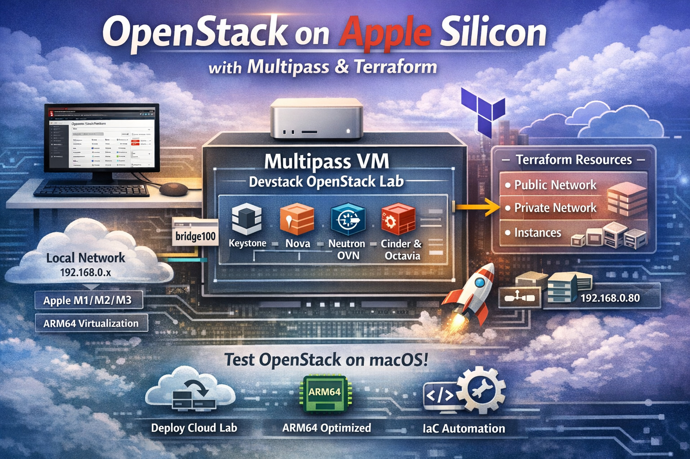
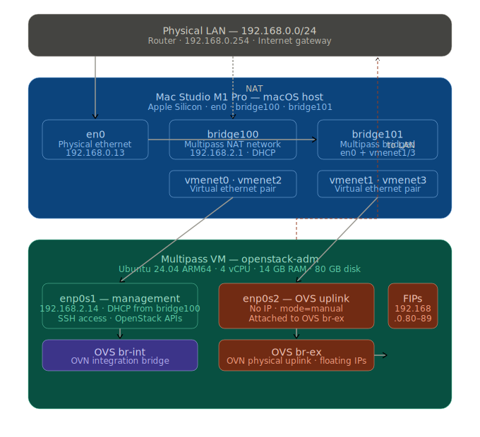
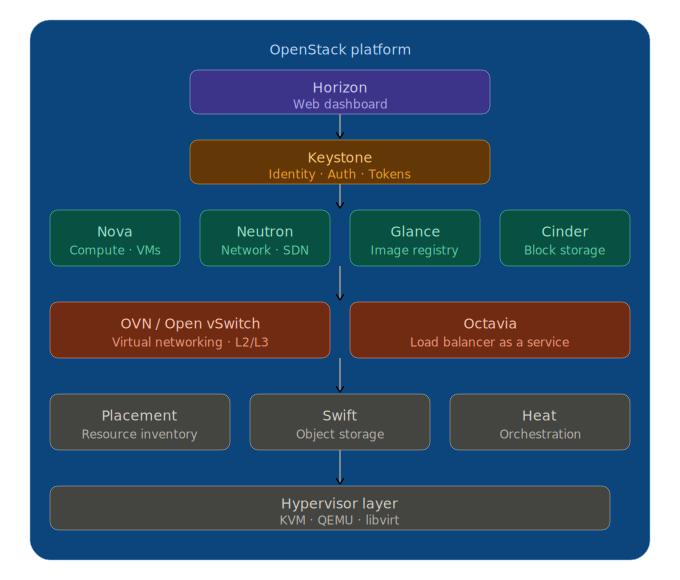
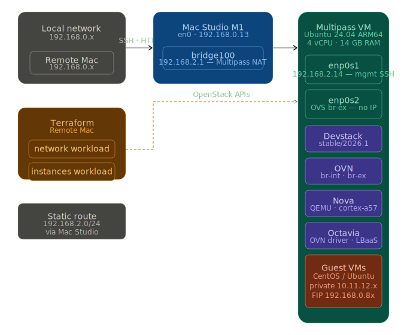
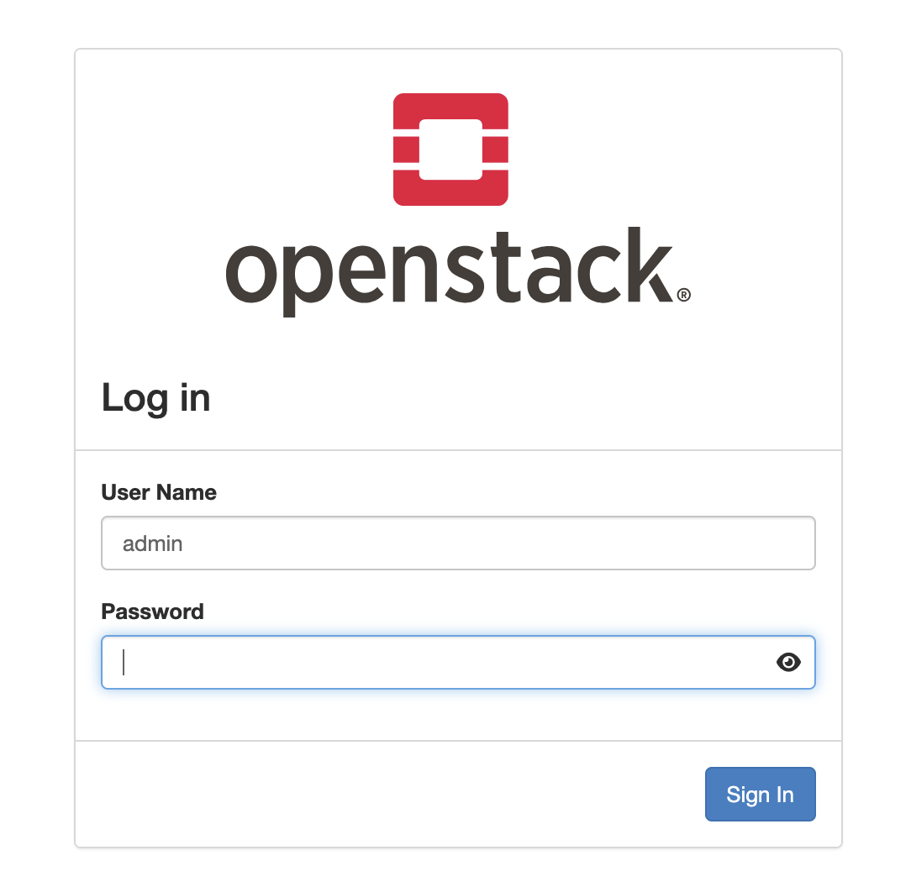

## 🚀 OpenStack Lab on Apple Silicon with Multipass & Terraform

A complete guide to deploy a OpenStack test environment on an Apple Silicon Mac using Multipass virtualization, Devstack, OVN networking, and Terraform infrastructure-as-code.


---


## 🌍 Introduction

OpenStack is an open-source cloud computing platform that allows you to build and manage both public and private clouds. It provides Infrastructure-as-a-Service (IaaS) capabilities equivalent to AWS, Azure, or OCI virtual machines, software-defined networking, block storage, object storage, and load balancing — all managed through a unified API and web dashboard.

This project demonstrates how to run a fully functional OpenStack environment on a Mac Studio M1 Pro using Multipass as the hypervisor layer. The goal is to provide a realistic test platform where infrastructure can be provisioned, tested, and torn down using the same Terraform workflows you would use against a production OpenStack cloud.

The goal is simple:
👉 bring a realistic cloud lab directly onto your Mac

This allows you to experiment, test, and automate infrastructure locally using the same tools and workflows used in production environments.

---

## 💡 Why this repository

Running OpenStack usually requires multiple servers, complex networking, and significant resources.

This repository exists to solve that problem by providing:

* 🧪 A local OpenStack lab for experimentation
* 🔁 A reproducible environment using Devstack
* 🏗️ Infrastructure provisioning via Terraform
* 💻 A solution optimized for Apple Silicon (ARM64)
* ⚡ A lightweight setup using Multipass instead of heavy hypervisors

🎯 Use cases

* Learn OpenStack architecture
* Test Terraform modules before production
* Validate cloud-init configurations
* Experiment with networking (Neutron + OVN)
* Build a personal cloud lab

⸻

## 🖥️ What is Multipass

Multipass is a lightweight VM manager developed by Canonical.

It allows you to run Ubuntu virtual machines on macOS, Linux, and Windows using native hypervisors.



🔑 Key features

* ⚡ Fast VM provisioning (seconds)
* 🧩 Native integration with macOS hypervisor
* 🪶 Lightweight compared to VirtualBox/VMware
* 🧑‍💻 CLI-first (perfect for automation)
* 🐧 Optimized for Ubuntu workloads

🤔 Why Multipass for this project?

On Apple Silicon:

* Traditional hypervisors can be heavy or unstable
* Multipass provides ARM64-native virtualization
* Works perfectly with Devstack and Open vSwitch

👉 It’s the ideal tool to run OpenStack locally on a Mac.

---

## ☁️  OpenStack core services

OpenStack is composed of loosely coupled services, each responsible for a specific infrastructure concern. They communicate through REST APIs and a shared message bus (RabbitMQ).



### 🔐 Identity — Keystone

Keystone is the authentication and authorization backbone of OpenStack. Every API call to any service must first pass through Keystone to obtain a token. It manages users, projects (tenants), roles, and domains. It also acts as a service catalog, listing the endpoints for every OpenStack service.

### 🖥️ Compute — Nova

Nova orchestrates the lifecycle of virtual machines. It decides which physical host runs each VM (scheduling), calls libvirt/QEMU to create the instance, and manages operations like resize, migrate, and snapshot. Nova does not handle networking or storage directly — it delegates to Neutron and Cinder via their APIs.

### 🌐 Networking — Neutron

Neutron provides Software-Defined Networking (SDN) for OpenStack. It manages virtual networks, subnets, routers, security groups, floating IPs, and load balancers. In this lab we use OVN (Open Virtual Network) as the Neutron backend, which implements L2 and L3 switching entirely in the kernel via Open vSwitch flow tables — no separate network namespace agents needed.

### 🌐 Image — Glance

Glance is the image registry. It stores and serves VM disk images (qcow2, raw, vmdk) that Nova uses to boot instances. Images carry metadata properties that inform Nova about the hardware requirements of the guest — architecture, machine type, firmware type, disk bus.

### 💽 Block storage — Cinder

Cinder provides persistent block storage volumes that can be attached to and detached from running instances, similar to AWS EBS. Volumes survive instance termination and can be snapshotted or cloned.

### 🖥️ Dashboard — Horizon

Horizon is the web-based graphical interface for OpenStack. It wraps the underlying APIs in a browser UI, providing access to all resources — instances, networks, images, volumes, load balancers — for both administrators and regular users.

### ⚖️ Load balancer — Octavia

Octavia is OpenStack's Load Balancer as a Service (LBaaS). In this lab it runs with the OVN driver, meaning load balancing rules are implemented directly in OVN flow tables without spawning separate Amphora VM instances. A load balancer exposes a Virtual IP (VIP) that distributes traffic across a pool of backend instances.

### 📊 Placement

Placement tracks resource inventories and allocations across compute nodes — vCPUs, memory, disk, and custom resource classes. Nova consults Placement during scheduling to find hosts that can satisfy a VM's resource requirements.

---

## 🏗️ Lab architecture




### 🧠 Key networking insight

The critical configuration that makes OVN routing work on Multipass is dedicating `enp0s2` to OVS with no IP address, while keeping `enp0s1` as the untouched management interface. Devstack uses `PUBLIC_INTERFACE=enp0s2` to attach this interface to `br-ex`, giving OVN a physical path to route floating IP traffic onto the local network.

---

## ⚙️ Prerequisites

- Apple Silicon Mac (M1/M2/M3) with at least 16 GB RAM
- macOS 13 or later
- [Multipass](https://multipass.run) installed
- [Terraform](https://developer.hashicorp.com/terraform/install) >= 1.0 installed on the remote Mac
- A static route on your router: `192.168.2.0/24` via Mac Studio IP
- SSH keypair generated: `ssh-keygen -t ed25519 -f ~/.ssh/id_openstack`

---

## 🧱 Multipass VM setup

Create the VM with two network interfaces — one for management, one dedicated to OVS:

```bash
multipass launch 24.04 \
  --name openstack-adm \
  --cpus 4 \
  --memory 12G \
  --disk 200G \
  --network "name=en0,mode=manual"

multipass shell openstack-adm
```

Inside the VM, verify the interfaces:

```bash
ip addr show enp0s1   # management — 192.168.2.x  (keep this untouched)
ip addr show enp0s2   # no IP — will be used by OVS
```

Prepare the system:

```bash
sudo apt update && sudo apt upgrade -y
sudo apt install -y git python3-openstackclient \
  openvswitch-switch openvswitch-common

sudo useradd -s /bin/bash -d /opt/stack -m stack
echo "stack ALL=(ALL) NOPASSWD: ALL" | sudo tee /etc/sudoers.d/stack
sudo chmod 0440 /etc/sudoers.d/stack
sudo usermod -aG stack www-data
sudo chmod +x /opt/stack
sudo chown -R stack:stack /opt/stack
sudo systemctl enable --now openvswitch-switch
```

---

## 🔥 Devstack installation

Devstack is used to deploy a development-grade OpenStack environment quickly.

⚠️ Important:
- Not meant for production
- Perfect for labs and testing

Clone Devstack and create the configuration file:

```bash
sudo -u stack -i
git clone https://opendev.org/openstack/devstack /opt/stack/devstack
cd /opt/stack/devstack
git checkout stable/2026.1
```

Create `/opt/stack/devstack/local.conf`:

```ini
[[local|localrc]]
ADMIN_PASSWORD=xxxx
DATABASE_PASSWORD=xxxx
RABBIT_PASSWORD=xxxx
SERVICE_PASSWORD=xxxx
GIT_BASE=https://opendev.org

# Octavia OVN driver
OCTAVIA_NODE_KIND=standalone
OCTAVIA_DRIVER=ovn
OCTAVIA_AMP_IMAGE_NAME=cirros-0.6.2-aarch64-disk
OCTAVIA_AMP_FLAVOR_ID=1
OCTAVIA_MGMT_SUBNET=172.16.0.0/24
OCTAVIA_MGMT_SUBNET_START=172.16.0.2
OCTAVIA_MGMT_SUBNET_END=172.16.0.200
OCTAVIA_MGMT_PORT_IP=172.16.0.1

# Network — enp0s1 for management, enp0s2 dedicated to OVS
PUBLIC_INTERFACE=enp0s2
HOST_IP=192.168.2.14          # IP of enp0s1 — adjust to your VM
SERVICE_HOST=$HOST_IP
NO_PROXY=$HOST_IP,127.0.0.1,localhost,192.168.2.0/24,192.168.0.0/24

# OVN backend
Q_AGENT=ovn
NEUTRON_BACKEND=ovn
ML2_L3_PLUGIN=ovn-router
Q_ML2_PLUGIN_MECHANISM_DRIVERS=ovn,logger
Q_ML2_PLUGIN_TYPE_DRIVERS=local,flat,vlan,geneve
Q_ML2_TENANT_NETWORK_TYPE=geneve
OVN_BUILD_FROM_SOURCE=False
OVN_BRIDGE_MAPPINGS="public:br-ex"
OVN_L3_CREATE_PUBLIC_NETWORK=True

# Floating IP pool on local network
FLOATING_RANGE="192.168.0.0/24"
PUBLIC_NETWORK_GATEWAY="192.168.0.254"    # your router gateway
Q_FLOATING_ALLOCATION_POOL="start=192.168.0.80,end=192.168.0.89"
FIXED_RANGE="10.11.12.0/24"
NETWORK_GATEWAY="10.11.12.1"
NEUTRON_CREATE_INITIAL_NETWORKS=False

# Disabled services
disable_service tempest
disable_service swift
disable_service etcd3

# Plugins
enable_plugin neutron $GIT_BASE/openstack/neutron
enable_plugin octavia $GIT_BASE/openstack/octavia stable/2026.1
enable_plugin ovn-octavia-provider $GIT_BASE/openstack/ovn-octavia-provider
ENABLED_SERVICES+=,octavia,o-api,o-cw,o-hm,o-hk,o-da
ENABLED_SERVICES+=,ovn-octavia-provider

# ARM64 image
IMAGE_URLS="http://download.cirros-cloud.net/0.6.2/cirros-0.6.2-aarch64-disk.img"

SERVICE_TIMEOUT=1200
LOGFILE=/opt/stack/logs/stack.sh.log
VERBOSE=True
PYTHON=/opt/stack/data/venv/bin/python3
```

Apply the required patch for OVN Python environment, then launch:

```bash
sed -i 's|\$PYTHON|/opt/stack/data/venv/bin/python3|g' \
  /opt/stack/devstack/lib/neutron_plugins/ovn_agent

export PATH=/usr/local/sbin:/usr/local/bin:/usr/sbin:/usr/bin:/sbin:/bin
./stack.sh 2>&1 | tee /tmp/stack.log
```

Installation takes approximately 10 minutes on Apple Silicon.

After installation, attach `enp0s2` to `br-ex` and make it permanent:

```bash
sudo ovs-vsctl add-port br-ex enp0s2
sudo ip link set enp0s2 up
sudo ip link set br-ex up

sudo tee /etc/systemd/system/ovs-br-ex.service << 'EOF'
[Unit]
Description=Attach enp0s2 to OVS br-ex
After=ovsdb-server.service
Wants=ovsdb-server.service

[Service]
Type=oneshot
RemainAfterExit=yes
ExecStart=/bin/bash -c '\
  /usr/bin/ovs-vsctl --may-exist add-port br-ex enp0s2; \
  /usr/sbin/ip link set enp0s2 up; \
  /usr/sbin/ip link set br-ex up'

[Install]
WantedBy=multi-user.target
EOF

sudo systemctl enable --now ovs-br-ex
```

---

## 🌐 Access to Horizon dashboard

Once the installation is complete, you can access the OpenStack web interface (Horizon dashboard).

👉 Open your browser and go to:

http://HOST_IP/dashboard

🔐 Login credentials:
- Username: admin
- Password: the value defined in `local.conf` (ADMIN_PASSWORD)

This dashboard allows you to manage:
- Instances (VMs)
- Networks and routers
- Images
- Volumes
- Load balancers
- Security ....

You now have a fully operational OpenStack environment accessible from your browser 🚀



---

## 🧠 ARM64-specific fixes

Running OpenStack on Apple Silicon introduces unique challenges:

- CPU model mismatch
- Metadata service issues
- OVS integration quirks

### ⚙️ Nova compute — correct CPU model

Edit `/etc/nova/nova-cpu.conf` and ensure the `[libvirt]` section contains:

```ini
[libvirt]
live_migration_uri = qemu+ssh://stack@%s/system
virt_type = qemu
cpu_mode = custom
cpu_models = cortex-a57
hw_machine_type = aarch64=virt
```

The default `cortex-a15` is a 32-bit CPU model and causes `XML error: No PCI buses available` when Nova tries to spawn a VM.

```bash
sudo systemctl restart devstack@n-cpu
```

---

## 📦 Loading a CentOS 9 Stream cloud image

OpenStack requires cloud images standard OS images that include `cloud-init` pre-installed and configured to read metadata from the platform at first boot. Regular ISO installation images will not work.

### 📥 Download the official CentOS 9 Stream cloud image

On the OpenStack VM, download the official ARM64 cloud image directly from the CentOS project:

```bash
source /opt/stack/devstack/openrc admin admin

# Download CentOS Stream 9 cloud image for ARM64
wget -q \
  https://cloud.centos.org/centos/9-stream/aarch64/images/CentOS-Stream-GenericCloud-9-latest.aarch64.qcow2 \
  -O /tmp/centos-9-arm64.qcow2

# Verify the download
ls -lh /tmp/centos-9-arm64.qcow2
```

### ☁️ Upload the image to Glance

Upload the image with the correct ARM64 hardware properties. These properties are critical — without them Nova will generate an incorrect libvirt XML and the VM will fail to start on ARM64:


```bash
openstack image create "centos-9-stream-arm64" \
  --file /tmp/centos-9-arm64.qcow2 \
  --disk-format qcow2 \
  --container-format bare \
  --public \
  --property hw_architecture=aarch64 \
  --property hw_machine_type=virt \
  --property hw_firmware_type=uefi \
  --property hw_disk_bus=virtio \
  --property os_type=linux

```


### 🏷️  Property reference

| Property | Value | Purpose |
|----------|-------|---------|
| `hw_architecture` | `aarch64` | Tells Nova to generate ARM64 libvirt XML |
| `hw_machine_type` | `virt` | QEMU machine type for ARM (not `pc`) |
| `hw_firmware_type` | `uefi` | Use AAVMF UEFI firmware instead of BIOS |
| `hw_disk_bus` | `virtio` | Ensures the disk is visible to the kernel at boot |
| `os_type` | `linux` | Guest OS hint for Nova/libvirt |

### 🔍 Verify the image

```bash
openstack image list
openstack image show centos-9-stream-arm64 | grep properties
```


### 🔄 Update an existing image

If you uploaded an image without the correct properties, you can update it without re-uploading:

```bash
openstack image set \
  --property hw_architecture=aarch64 \
  --property hw_machine_type=virt \
  --property hw_firmware_type=uefi \
  --property hw_disk_bus=virtio \
  --property os_type=linux \
  centos-9-stream-arm64
```

### 🔑 Default credentials

| Image | Default user | Authentication |
|-------|-------------|----------------|
| CentOS Stream 9 | `cloud-user` | SSH key only (injected via cloud-init) |
| Ubuntu 22.04 | `ubuntu` | SSH key only (injected via cloud-init) |
| CirrOS | `cirros` | Password: `gocubsgo` |

> Note: password login is disabled by default on cloud images. SSH key injection via `config_drive = true` is required on this setup — see the [Known issues](#known-issues-and-fixes) section.


### 💿 Config drive — bypassing the metadata proxy

On this setup the Nova metadata proxy (HAProxy in the OVN namespace) does not correctly inject the `X-Instance-ID` header required by the metadata API. Cloud-init therefore cannot retrieve SSH keys or user-data via `169.254.169.254`.

The solution is to use a config drive, which packages all instance metadata into a virtual CD-ROM that cloud-init reads directly at boot — no network required for initialization.

In Terraform, always set:

```hcl
resource "openstack_compute_instance_v2" "web" {
  config_drive = true
  ...
}
```

---


## 🧾 OpenStack CLI client and admin credentials

### 🛠️ Install the OpenStack client

On your remote work station, install the OpenStack Python client inside a virtual environment:

```bash
# Create a dedicated virtual environment
python3 -m venv ~/openstack_venv
source ~/openstack_venv/bin/activate

# Install the client
pip install python-openstackclient

# Verify
openstack --version
```

Add this to your `~/.zshrc` or `~/.bashrc` to activate it automatically:

```bash
alias openstack-activate='source ~/openstack_venv/bin/activate'
```

### 🔐 Retrieve the admin credentials from Horizon

The easiest way to get a working `openrc` file is to download it directly from the Horizon dashboard:

1. Open your browser and navigate to `http://192.168.2.14/dashboard`
2. Log in with username `admin` and password `secret`
3. In the top-right corner, click on **admin** → **OpenStack RC File**
4. Select **OpenStack RC File** (v3)
5. Save the downloaded file as `admin-openrc.sh`


### 📄 The admin-openrc.sh file

The downloaded file looks like this:

```bash
#!/usr/bin/env bash

export OS_AUTH_URL=http://192.168.2.14/identity/v3
export OS_PROJECT_ID=xxxxxxxxxxxxxxxxxxxxxxxxxxxxxxxx
export OS_PROJECT_NAME="admin"
export OS_USER_DOMAIN_NAME="Default"
export OS_PROJECT_DOMAIN_ID="default"
export OS_USERNAME="admin"
export OS_PASSWORD="secret"
export OS_REGION_NAME="RegionOne"
export OS_INTERFACE=public
export OS_IDENTITY_API_VERSION=3
export OS_IMAGE_API_VERSION=2
```

### ▶️ Source the credentials and test

```bash
# Activate the virtual environment
source ~/openstack_venv/bin/activate

# Load the credentials
source ~/admin-openrc.sh

# Test the connection
openstack token issue
openstack server list
openstack network list
```

### 📚 Useful CLI commands

```bash
# List all resources
openstack server list
openstack network list
openstack image list
openstack flavor list
openstack floating ip list
openstack keypair list

# Create a keypair from your existing SSH key
openstack keypair create \
  --public-key ~/.ssh/id_openstack.pub \
  my-key

# Assign a floating IP to a server
openstack floating ip create public
openstack server add floating ip <server-name> <floating-ip>

# Get the console URL
openstack console url show <server-name>

# View instance boot log
openstack console log show <server-name>
```


---

## 💻 Terraform — network workload

The network workload creates the foundational OpenStack resources: public provider network, private tenant network, router, and security groups.


### 📂 Directory structure

```
terraform/network/
├── main.tf        — network, subnet, router, security group resources
├── variables.tf   — all configurable parameters
├── versions.tf    — provider configuration and endpoint overrides
└── outputs.tf     — resource IDs
```

### 🤫 Managing secrets with terraform.tfvars

Never hardcode passwords in your Terraform files. Create a `secrets.tfvars`
file to store all sensitive values:

```hcl
# secrets.tfvars — never commit this file to Git

# OpenStack admin credentials
password          = "xxxx"

# VM instance credentials
instance_password = "xxxx"   
```

### 📄 versions.tf — provider configuration

```hcl
terraform {
  required_version = ">= 1.0"
  required_providers {
    openstack = {
      source  = "terraform-provider-openstack/openstack"
      version = "~> 2.0"
    }
  }
}

provider "openstack" {
  auth_url    = var.auth_url
  user_name   = var.user_name
  password    = var.password
  tenant_name = var.tenant_name
  domain_name = var.domain_name
  region      = var.region

  endpoint_type = "public"
  endpoint_overrides = {
    network  = "http://192.168.2.14/networking/v2.0/"
    compute  = "http://192.168.2.14/compute/v2.1/"
    identity = "http://192.168.2.14/identity/v3/"
    image    = "http://192.168.2.14/image/v2/"
    volume   = "http://192.168.2.14/volume/v3/"
  }
}
```

> **Important:** The IP address `192.168.2.14` in the `endpoint_overrides` block
> must match the current IP of your Multipass VM (`enp0s1` interface).
> This IP is assigned dynamically by Multipass and may change each time the VM
> is recreated.
>
> To get the current IP:
> ```bash
> multipass info openstack-adm | grep IPv4
> ```

> **Important:** The IP address `192.168.2.14` must also be updated in
> `variables.tf` for the `auth_url` variable:
>
> ```hcl
> variable "auth_url" {
>   default = "http://<your-vm-ip>/identity/v3"
> }
> ```

### 📄 main.tf — key resources

```hcl
# Public provider network (flat, mapped to br-ex)
resource "openstack_networking_network_v2" "public" {
  name           = var.public_network_name
  admin_state_up = true
  external       = true
  shared         = true
  segments {
    physical_network = "public"
    network_type     = "flat"
  }
}

# Private tenant network
resource "openstack_networking_network_v2" "private" {
  name           = var.private_network_name
  admin_state_up = true
  shared         = false
}

# Router connecting private to public
resource "openstack_networking_router_v2" "router1" {
  name                = var.router_name
  admin_state_up      = true
  external_network_id = openstack_networking_network_v2.public.id
}
```

### 🚀 Deploy

```bash
cd terraform/network
terraform init
terraform apply
```

---

## 💻 Terraform — instances workload

The instances workload deploys a web server VM with a floating IP.

This part deploys actual compute resources:

- VM instances
- Floating IPs
- SSH access


### 📂 Directory structure

```
terraform/instances/
├── instance.tf    — keypair, security group, VM, floating IP
├── variables.tf   — image, flavor, SSH key path, password
├── versions.tf    — same provider configuration as network workload
└── outputs.tf     — floating IP, SSH command, web URL
```

### 📄 instance.tf — key configuration

```hcl
resource "openstack_compute_instance_v2" "web" {
  name            = var.instance_name
  image_name      = var.image_name
  flavor_name     = var.flavor_name
  key_pair        = openstack_compute_keypair_v2.ma_cle.name
  security_groups = [openstack_networking_secgroup_v2.web.name]
  config_drive = true

  network {
    uuid = data.openstack_networking_network_v2.private.id
  }

   user_data = <<EOF
#cloud-config
password: ${var.instance_password}
chpasswd: { expire: False }
ssh_pwauth: True

packages:
  - cockpit

runcmd:
  - systemctl enable --now cockpit.socket
  - systemctl disable --now firewalld
EOF

  depends_on = [openstack_networking_secgroup_v2.web]
}
```

### 🚀 Deploy

```bash
cd terraform/instances
terraform init
terraform apply
```

After deployment, the outputs show:

```
floating_ip = "192.168.0.8x"
web_url     = "http://192.168.0.8x"
ssh_command = "ssh cloud-user@192.168.0.8x"
```

Connect:

```bash
ssh -i ~/.ssh/id_openstack cloud-user@192.168.0.8x

```


### 🌐 Accessing the Cockpit web console

Once the instance is deployed and cloud-init has finished (allow 2–3 minutes), 
the Cockpit web console is accessible directly from your browser:

https://192.168.0.8x:9090


Replace `192.168.0.8x` with the floating IP shown in the Terraform output:

```bash
terraform output floating_ip
```

**Login credentials:**

| Field | Value |
|-------|-------|
| Username | `cloud-user` |
| Password | defined in `var.instance_password` (default: `secret123`) |

> Your browser will display a certificate warning — this is expected since Cockpit
> uses a self-signed certificate by default. Click **Advanced** → **Accept the risk
> and continue** to proceed.

Cockpit gives you a full web-based terminal, system metrics, network configuration,
service management and log viewer — all without requiring an SSH client.

---


## 🐞 Known issues and fixes

| Issue | Cause | Fix |
|-------|-------|-----|
| `No PCI buses available` | Nova uses `cortex-a15` (32-bit) CPU | Set `cpu_models = cortex-a57` in `nova-cpu.conf` |
| `ModuleNotFoundError: No module named 'neutron'` | OVN agent uses system Python | Patch `$PYTHON` → venv path in `ovn_agent` |
| `br-ex` empty after install | Devstack cannot attach interface it doesn't own | Manually attach `enp0s2` + create systemd service |
| Cloud-init no SSH key | Metadata proxy returns 400 (missing `X-Instance-ID`) | Use `config_drive = true` in Terraform |
| VM boots but no network | `hw_disk_bus` not set on image | Add `--property hw_disk_bus=virtio` to image |
| `octavia-dashboard` crash | Incompatible with this Devstack version | Remove from `local.conf` |

---

## 🎯 Conclusion

This project demonstrates that a fully operational OpenStack cloud — with compute, networking, load balancing, and infrastructure-as-code deployment — can run on a single Apple Silicon Mac. The combination of Multipass for lightweight ARM64 virtualization, Devstack for rapid OpenStack deployment, OVN for high-performance software-defined networking, and Terraform for repeatable infrastructure provisioning creates a powerful local lab environment.

The most significant challenges encountered were specific to the ARM64 architecture on Apple Silicon: the QEMU CPU model mismatch (`cortex-a15` vs `cortex-a57`), the OVN metadata proxy not forwarding instance identity headers correctly, and the OVS bridge requiring manual physical interface attachment.

Each of these issues has a documented fix in this guide. The resulting environment faithfully mirrors the workflow of a production OpenStack deployment — provision networks and instances with Terraform, connect via SSH using injected keys, expose services through floating IPs — making it an effective platform for learning, testing Terraform modules, validating cloud-init configurations, and exploring OpenStack APIs before deploying to production infrastructure.

---

## 📚 References


[DevStack](https://docs.openstack.org/devstack/latest/)
[OpenStack Platform Components](https://docs.redhat.com/en/documentation/red_hat_openstack_platform/8/html/architecture_guide/components)


---

## 🚀 Next steps

### 🏢 Multi-tenancy and reseller portal

This lab demonstrates a single-tenant OpenStack deployment. To evolve toward a
production multi-tier architecture — where a hosting provider manages resellers
who in turn manage their own end customers — several open-source solutions can
be layered on top of OpenStack.

#### Option 1 — Native OpenStack multi-tenancy

OpenStack natively supports multi-tenancy through **projects** (tenants),
**domains**, **roles**, and **quotas**. This covers the most common use case
where a single organisation needs isolated environments per team or customer:

```bash
# Create a reseller project
openstack project create --domain default reseller-a

# Create a user for that project
openstack user create --domain default \
  --password secret reseller-a-admin

# Assign admin role on that project
openstack role add --project reseller-a \
  --user reseller-a-admin admin

# Set resource quotas
openstack quota set \
  --instances 20 --cores 40 --ram 102400 \
  --floating-ips 10 \
  reseller-a
```

This approach works well for internal teams or direct customers but does not
provide a self-service reseller portal or cascade billing.

#### Option 2 — Adjutant (open-source onboarding layer)

[Adjutant](https://docs.openstack.org/adjutant/latest/) is an official OpenStack
project that adds self-service workflows on top of Keystone — account sign-up,
project provisioning, quota requests, and email notifications. It is lightweight
and integrates directly with the existing OpenStack API.

#### Option 3 — CloudKitty (billing and rating)

[CloudKitty](https://docs.openstack.org/cloudkitty/latest/) is the OpenStack
billing and rating service. It measures resource consumption per project and
generates usage reports — the foundation for charging resellers or internal
cost centres.

```bash
# Install CloudKitty via Devstack plugin
enable_plugin cloudkitty \
  https://opendev.org/openstack/cloudkitty
```

#### Option 4 — Virtuozzo Hybrid Infrastructure (commercial)

For a full hosting-provider model with nested tenancy — where resellers
autonomously manage their own customers without operator intervention —
**Virtuozzo Hybrid Infrastructure** (VHI) is the reference solution used
by European hosters migrating from VMware.

VHI installs on a separate set of servers and connects to OpenStack via its
standard REST APIs, adding:

- A self-service **reseller portal** — each reseller manages their own
  customers independently
- **Cascade billing** — consumption is metered at every level:
  operator → reseller → end customer
- **Nested quota management** — resellers allocate resources to customers
  from their own pool
- **White-label branding** — each reseller can present a customised portal
  to their customers
---


This is the architecture adopted by hosting providers migrating from VMware vSphere + vCloud Director to OpenStack + VHI OpenStack handles the bare-metal infrastructure layer while VHI provides the commercial reseller abstraction above it.


