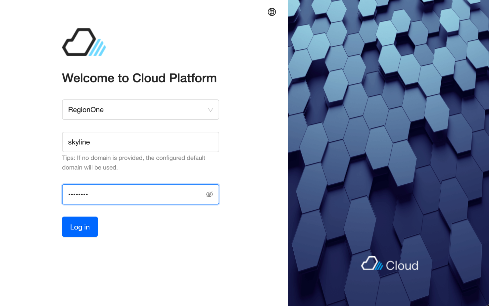

# 🌤️ OpenStack Skyline — Modern Dashboard Installation Guide

Skyline is the next-generation OpenStack dashboard, built with Vue.js and a modern REST API backend. It replaces the aging Horizon interface with a clean, responsive UI and significantly better performance.

> This guide covers installation on an existing OpenStack Devstack environment (Ubuntu 24.04, ARM64).

---

## ✅ Prerequisites

> All the following steps must be performed **on the OpenStack VM** (`openstack-adm`),
> not on your work station.
>
> Connect first:
> ```bash
> multipass shell openstack-adm
> # or
> ssh ubuntu@192.168.2.14
> ```


Before starting, ensure the following packages are installed:

```bash
sudo apt update
sudo apt install -y python3-venv python3-pip \
  git nginx curl \
  libssl-dev libffi-dev python3-dev \
  build-essential
```

Clone the Skyline repositories:

```bash
cd /root
git clone https://opendev.org/openstack/skyline-apiserver.git
git clone https://opendev.org/openstack/skyline-console.git
```

---

## 🐍 Create Python virtual environments

### Install skyline-apiserver

```bash
python3 -m venv /opt/skyline-apiserver-venv
/opt/skyline-apiserver-venv/bin/pip install --upgrade pip
/opt/skyline-apiserver-venv/bin/pip install /root/skyline-apiserver
```

Verify:

```bash
/opt/skyline-apiserver-venv/bin/skyline-apiserver --version
```

### Install skyline-console

```bash
python3 -m venv /opt/skyline-console-venv
/opt/skyline-console-venv/bin/pip install --upgrade pip
/opt/skyline-console-venv/bin/pip install /root/skyline-console
```

---


### 🔐 Authentication : create a skyline 

```bash
source /opt/stack/devstack/openrc admin admin
openstack user show skyline
# If missing:
openstack user create --domain Default --password skyline skyline
openstack role add --project service --user skyline admin
systemctl restart skyline-apiserver
```

---

## ⚙️ Configure Skyline

```bash
mkdir -p /etc/skyline
mkdir -p /var/log/skyline
mkdir -p /var/lib/skyline
```

Create `/etc/skyline/skyline.yaml`:

```yaml
default:
  debug: false
  log_dir: /var/log/skyline
  log_file: skyline.log
  ssl_enabled: false
  database_url: sqlite:////tmp/skyline.db
  secret_key: change_me_to_a_random_string

openstack:
  keystone_url: http://192.168.2.14/identity/v3/
  default_region: RegionOne
  interface_type: public
  system_user_name: skyline
  system_user_password: YOUR_PASSWORD
  system_user_domain: Default
  system_project: service
  system_project_domain: Default
  user_default_domain: Default
  nginx_prefix: /api/openstack
```

> Replace `192.168.2.14` with your VM IP and `YOUR_PASSWORD` with the password
> set in the next step.

Generate a secure `secret_key`:

```bash
python3 -c "import secrets; print(secrets.token_hex(32))"
```

---

## 👤 Create the Skyline service user

```bash
source /opt/stack/devstack/openrc admin admin

openstack user create \
  --domain Default \
  --password skyline \
  skyline

openstack role add \
  --project service \
  --user skyline \
  admin

# Verify
openstack user show skyline
```

---

## 🗄️ Initialize the database

> ⚠️ **This step is critical.** Skipping it will cause login to fail with:
> ```
> sqlite3.OperationalError: no such table: revoked_token
> ```

```bash
cd /root/skyline-apiserver

/opt/skyline-apiserver-venv/bin/alembic \
  -c skyline_apiserver/db/alembic/alembic.ini \
  upgrade head
```

Verify the database was created:

```bash
ls -lh /tmp/skyline.db
```

---

## 🔧 Configure Gunicorn

Edit `/etc/skyline/gunicorn.py` and change the `bind` line:

```python
# Before (default — Unix socket)
bind = "unix:/var/lib/skyline/skyline.sock"

# After — TCP port
bind = "0.0.0.0:28000"
```

Full minimal `gunicorn.py`:

```python
import multiprocessing

bind = "0.0.0.0:28000"
workers = multiprocessing.cpu_count() * 2 + 1
worker_class = "uvicorn.workers.UvicornWorker"
keepalive = 5
reuse_port = True
forwarded_allow_ips = "*"
```

---

## 🌐 Generate Nginx configuration

```bash
/opt/skyline-apiserver-venv/bin/skyline-nginx-generator \
  -o /etc/nginx/nginx.conf

# Verify syntax
nginx -t
```

---

## 🚀 Start services

Create a systemd service for the Skyline API server:

```bash
tee /etc/systemd/system/skyline-apiserver.service > /dev/null << EOF
[Unit]
Description=Skyline API Server
After=network.target

[Service]
Type=simple
User=root
ExecStart=/opt/skyline-apiserver-venv/bin/gunicorn \
  -c /etc/skyline/gunicorn.py \
  skyline_apiserver.main:app
Restart=on-failure
RestartSec=5
StandardOutput=append:/var/log/skyline/skyline.log
StandardError=append:/var/log/skyline/skyline.log

[Install]
WantedBy=multi-user.target
EOF

systemctl daemon-reload
systemctl enable skyline-apiserver
systemctl restart skyline-apiserver
systemctl restart nginx
```

Check both services are running:

```bash
systemctl status skyline-apiserver --no-pager
systemctl status nginx --no-pager
```

Verify the API responds:

```bash
curl -s http://localhost:28000/api/openstack/skyline/api/v1/version
```

---

## 🖥️ Access Skyline

Open your browser and navigate to:

```
http://192.168.2.14:9999
```



---

## 📚 References

[Skyline (Modern Dashboard)](https://opendev.org/openstack/skyline-console.git)


---


## 🎉 Conclusion

Skyline brings a modern, fast and intuitive interface to OpenStack a significant improvement over Horizon for day-to-day operations. Once installed, you have access to a fully functional web dashboard to manage your instances, networks, volumes and load balancers without touching the CLI.

Combined with the Terraform workloads described in the main [README](README.md), you now have a complete Infrastructure-as-Code workflow backed by a modern web interface a setup that closely mirrors what you would find in a production OpenStack environment.

---

## 🔍 Troubleshooting

### Login fails — `no such table: revoked_token`

The database was not initialized. Run:

```bash
cd /root/skyline-apiserver
/opt/skyline-apiserver-venv/bin/alembic \
  -c skyline_apiserver/db/alembic/alembic.ini \
  upgrade head
```

----
